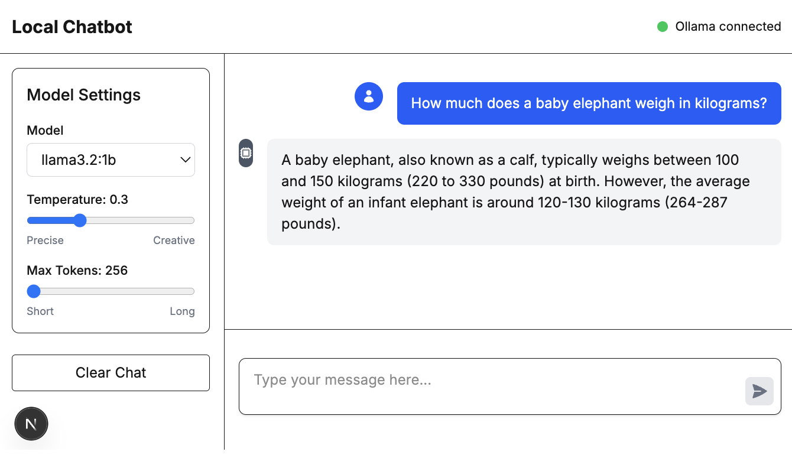

# Local Chatbot

A modern interface for interacting with locally running language models through Ollama.



## Usage

```bash
git clone https://github.com/yourusername/local-chatbot.git
cd local-chatbot

npm install

# Install and run ollama
brew install ollama
brew services start ollama

# Pull models
ollama pull llama3.2:1b

# Run the dev server
npm run dev
```

UI available at [http://localhost:3000](http://localhost:3000) (or another port if 3000 is in use).

## Configuration

Environment variables (`.env`):
- `NEXT_PUBLIC_DEFAULT_MODEL`: default is `llama3.2:1b`
- `NEXT_PUBLIC_OLLAMA_BASE_URL`: default is `http://localhost:11434`

## License

MIT
